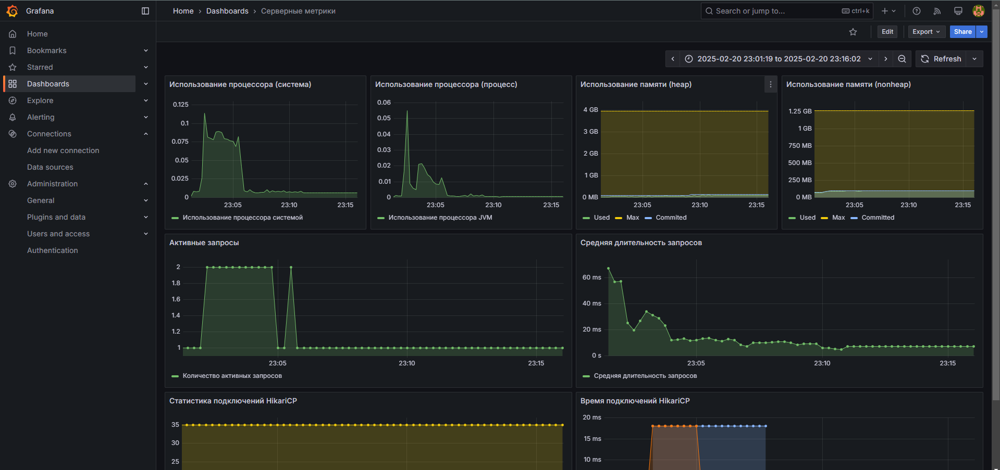

# Сторонние сервисы

Запущено 3 сторонних сервиса - Grafana, Prometheus, PostgreSQL.

## Grafana

Агрегатор статистики.

Запускается на порту 3000: http://localhost:3000.

После первого запуска необходимо ввести логин-пароль admin - admin, после чего придумать новый, более безопасный пароль.

Здесь вы можете найти статистику рекламных кампаний, рекламодателей, а также серверные метрики (статистику CPU, memory,
метрики базы данных при помощи HikariCP).

Выбор пал на связку Grafana - Prometheus, поскольку она позволяет эффективно и удобно собирать и представлять в виде
визуализаций статистику разного рода. Кроме того, это решение уже устоялось на рынке и используется многими компаниями.

Демонстрация работы Grafana

## Prometheus

Агрегатор метрик.

Запускается на порту 9090: http://localhost:9090.

Этот сервис необходим как прослойка между Grafana и самим приложением. Он делает запросы на статистику приложения, а
Grafana берёт у Prometheus уже собранную им статистику и строит графики.

## PostgreSQL

Современная высокопроизводительная СУБД. Используется для хранения всех данных приложения.
Не открывает доступ к своим портам извне связки сервисов.