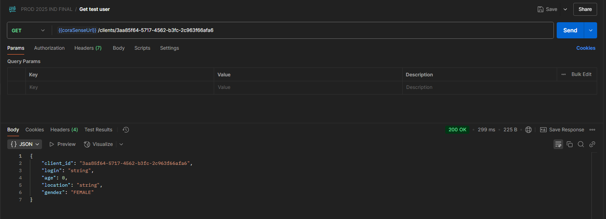
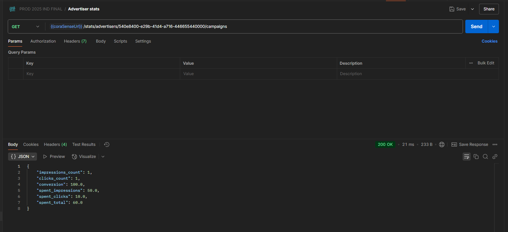

# Основной функционал

Документация по эндпоинтам API функционала доступна здесь: http://localhost:8080/swagger. 

Если необходимо получить доступ без запуска приложения, то тыкните [сюда](../openapi/api.json).

## Клиенты и рекламодатели
На Земле есть два типа людей - клиенты и рекламодатели. Клиенты смотрят рекламу, рекламодатели её придумывают и размещают
на нашей прекрасной платформе. И для тех, и для тех мы реализовываем API.

Ниже приведена демонстрация работы эндпоинтов, связанных с созданием/редактированием клиентов/рекламодателей.

Создание/сохранение клиентов

Получение клиента

Создание/сохранение рекламодателей

Получение рекламодателя

## Рекламные объявления
Объект преткновения всего приложения - рекламные объявления. Мы позволяем создавать, получать, редактировать и удалять их.

Создание рекламного объявления

Получение рекламного объявления

Получение рекламных объявлений рекламодателя

Изменение рекламного объявления

Удаление рекламного объявления

## Интересы клиентов
Не все клиенты одинаковые человеки, мы даём возможность учитывать их интересы двумя путями:
1. Таргетинг рекламы
2. Крутая ML, которая умеет определять интересы людей

Установка таргетинга в рекламе и у клиента

Установка ML скора

## И... показ!
Ради чего мы все тут собрались? Конечно же, чтобы показывать рекламу. Собственно, вот ожидаемый функционал.

Алгоритм работает следующим образом:
1. "Цена" рекламы высчитывается так: `cost_per_impression + CLICK_WEIGHT * cost_per_click`
2. Высчитывается максимальная и минимальная "цена", максимальный и минимальный ML скор за каждую рекламу (для тех, что подходят пользователю по таргетингу и лимитам)
3. Высчитывается нормализация "цены" и ML скора для каждой рекламы следующим образом: `(x - x_min) / (x_max - x_min)`. Нормализация умножается на коэффициенты,
заданные искусственным образом для "цены" и ML скора (веса). 
4. Высчитываются очки лимитов (чтобы наиболее полным образом заполнять лимиты, заданные рекламодателем): `1 - (impressions_count / impressions_limit)` и умножаются на коэффициент (вес)
5. Все значения складываются: `cost_score + ml_score + limit_score` = `campaign_score`.
6. Кампании сортируются по возрастанию `user_seen` (видел ли пользователь рекламу), по убыванию `campaign_score`, по убыванию "цены"
7. Берётся первая реклама из ответа

Показ рекламного объявления пользователю

Фиксация клика по рекламе

## Статистика
Конечно же, рекламодателям интересен ход их рекламной кампании. Поэтому вот демонстрация работы статистики:

Общая статистика рекламодателя

Ежедневная статистика рекламодателя

Общая статистика рекламной кампании

Ежедневная статистика рекламной кампании

## Машина времени
Наши инженеры изобрели машину времени, но сломали естественный ход времени. Поэтому теперь мы как Майкл Джей Фокс.

Машина времени

## Изображения в рекламных объявлениях
Картинки гораздо лучше привлекают человеческое внимание. Поэтому мы добавили возможность встраивать в объявления изображения.

Имеется 2 режима хранения картинок:
1. `FILE` - хранение картинок в локальной файловой системе. Для сохранения между перезапусками контейнера используется docker volume.
2. `S3` - удалённое S3 хранилище. Необходимо указать S3 ключ и S3 бакет.

Смотрите секцию [переменных среды](build-and-run.md) для настройки этого фукнционала.

Изображения хранятся в базе данных в паре id(uuid) - название_файла. В рекламные кампании их можно передать POST/PUT запросом в виде id.

Изображения можно удалять с хранилища и БД DELETE запросом. Но тогда нужно убедиться, что оно ни в какой кампании не используется.

При получении рекламы пользователь получает image_id. Он может его использовать, чтобы скачать/загрузить изображение
(в зависимости от параметра download, подробнее см. в OpenAPI спецификации).

Загрузка изображения

Скачивание изображения

Удаление изображения

Установка изображения в рекламное объявление

## Модерация
Не все рекламодатели и клиенты доброжелательны. Так что в приложении есть модерация в следующих контекстах:
1. Логин клиента
2. Имя рекламодателя
3. Заголовок рекламы
4. Текст рекламы

Существует два режима модерации:
1. `LLM` - модерация при помощи LLM
2. `BLACKLIST` - модерация при помощи задаваемого чёрного списка слов (см. в OpenAPI)

Модерация в приложении реализована крайне гибко. Необходимо задать общий режим модерации, а отдельно для
каждого контекста можно указать свой режим модерации. При необходимости можно исключить контекст из модерации вообще.
По умолчанию применены следующие настройки:
1. Логин клиента модерируется чёрным списком
2. Имя рекламодателя модерируется чёрным списком
3. Заголовок и текст рекламы модерируются так, как задано общим режимом модерации (по умолчанию - LLM).

Отклонение текста из-за непрохождения модерации

Связанные строчки в конфигурации

### Управление модерацией
1. Для настройки модерации при запущенном приложении реализованы специальные endpoint'ы. Подробнее в OpenAPI спецификации.
Этот способ подойдёт, только если настройки необходимо изменить оперативно без перезагрузки приложения.
2. Кроме того, модерацию можно настраивать через переменные среды. Подробнее в [другой секции](build-and-run.md).
3. Модерацию можно включать/выключать. Есть специальная переменная среды, кроме того, есть endpoint'ы.

P.S. Контексты модерации и их режимы настраиваются только двумя путями: прямым изменением конфигурации [здесь](../src/main/resources/application.conf),
либо эндпоинтами. Общий режим можно настроить при помощи переменной среды.

Скриншот из Swagger UI со связанными эндпоинтами

## Генерация текста при помощи LLM
Некоторые рекламодатели доверяют написание текста рекламы LLM. Мы дадим им эту возможность.

Мы реализовали эндпоинт, который выдаёт тексты реклам по запросу, нужно лишь передать ID рекламодателя и предполагаемый заголовок.

Требует включения LLM.

Генерация текста

## Визуализация статистики
Какие-то странные JSON'ы трудно понять людям, сидящим в своём кресле на последних этажах офисного центра
и попивающим кофе. Для них мы визуализировали статистику при помощи Grafana и Prometheus. Немного подробнее [здесь](foreign-services.md).

## Telegram бот
Чтобы рекламодателям стало совсем удобно, мы реализовали телеграм бота. Подробнее [тут](telegram.md)