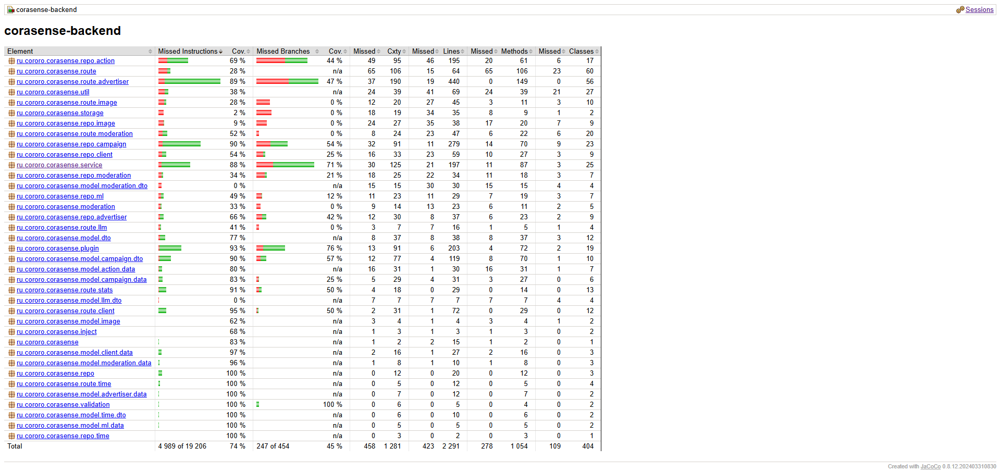

# Тестирование
Приложение тестируется при помощи двух типов тестов: `Unit` тестирование и `E2E` тестирование. И то, и другое реализовано
при помощи [Kotest](https://kotest.io/).

Оба типа тестирования запускаются командой (убедитесь что у вас установлен JDK 17).
```bash
./gradlew clean test
```

Кроме того, после этой команды формируется `test coverage` отчёт (при помощи JaCoCo), который можно найти по пути `build/jacocoHtml/index.html`
По последним подсчётам `test coverage` составил 74%.

